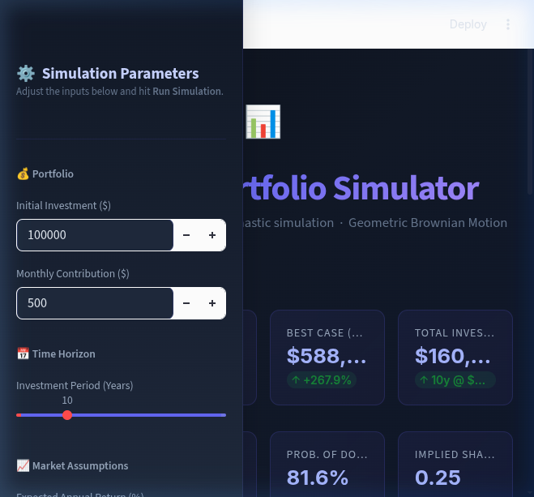

# Monte Carlo Portfolio Simulator

A professional-grade Monte Carlo portfolio simulator built with [Streamlit](https://streamlit.io/) and [Plotly](https://plotly.com/). It uses Geometric Brownian Motion (GBM) to forecast potential future portfolio returns, complete with interactive visualizations, risk metrics, and a premium dark-themed UI.



## Features

- **GBM Simulation Engine**: Models stock price paths using stochastic calculus (Geometric Brownian Motion) with drift correction.
- **Monthly Contributions**: Supports Dollar-Cost Averaging (DCA), adding contributions at approximately 21-day trading intervals.
- **Detailed Analytics**: Evaluates metrics like Value at Risk (VaR), Conditional VaR (CVaR), Skewness, Kurtosis, and Maximum Drawdown.
- **Four Interactive Tabs**:
  - **Simulation Paths**: Visualize generated paths with customizable confidence bands.
  - **Distribution**: Histogram, Box Plot, and Cumulative Distribution Function (CDF) of final portfolio values.
  - **Statistics**: Detailed tabular layout of risk and return metrics.
  - **Drawdown Analysis**: Drawdown profile of the median path and max drawdown distributions across all simulations.
- **Responsive UI**: Glassmorphism metric cards, gradient themes, and polished Plotly charts.

## Installation and Setup

### Prerequisites
Make sure you have Python 3.8+ installed.

### 1. Clone the repository
```bash
git clone https://github.com/yourusername/monte-carlo-simulator.git
cd monte-carlo-simulator
```
*(Note: Replace the URL with your actual GitHub repository URL after publishing)*

### 2. Create a virtual environment (Recommended)
```bash
python -m venv venv

# On Windows:
venv\Scripts\activate

# On macOS/Linux:
source venv/bin/activate
```

### 3. Install dependencies
```bash
pip install -r requirements.txt
```

### 4. Run the application
```bash
streamlit run app.py
```

The app will start instantly and open in your default web browser at `http://localhost:8501`.

## Usage

1. **Portfolio Settings**: Set your initial investment and monthly contribution.
2. **Time Horizon**: Choose the number of years you plan to invest.
3. **Market Assumptions**: Adjust the expected annual return and annual volatility based on the asset class or historical data.
4. **Simulation Settings**: Select the number of simulations to run and your preferred confidence interval.
5. Click **Run Simulation** to generate the stochastic paths and analyze the results.

## Technologies Used

- **[Streamlit](https://streamlit.io/)**: Fast, modern way to build and share data apps.
- **[Plotly Express & Graph_Objects](https://plotly.com/python/)**: Interactive and declarative charting.
- **[NumPy](https://numpy.org/)**: High-performance array operations for the Monte Carlo engine.
- **[Pandas](https://pandas.pydata.org/)**: Data manipulation and tabular data formatting.

## License

This project is licensed under the [MIT License](LICENSE).
